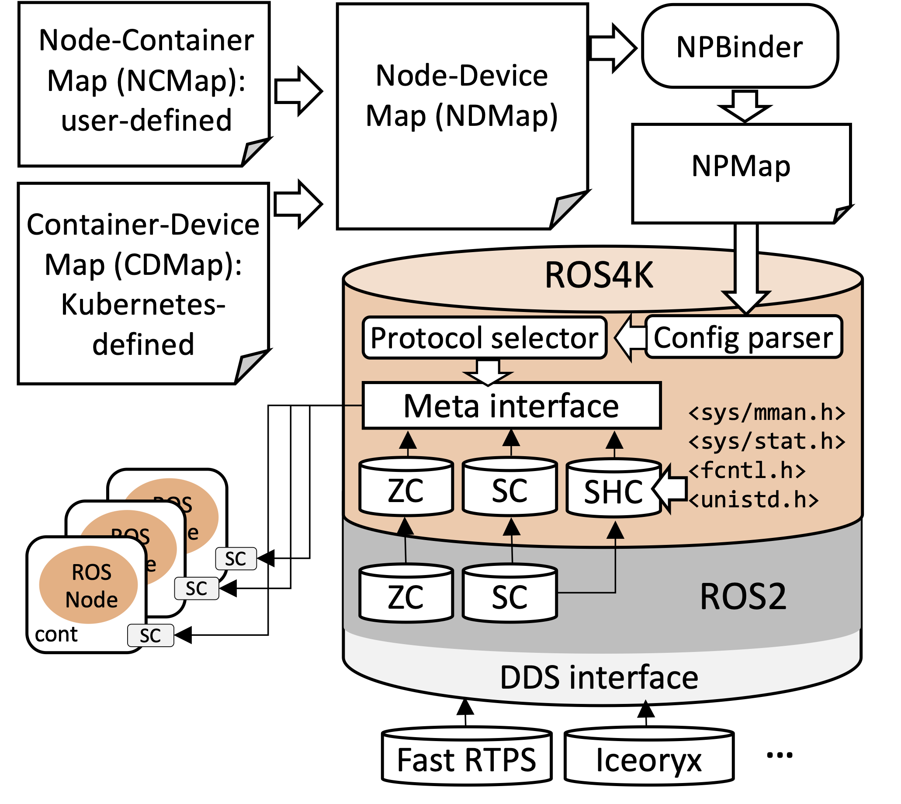
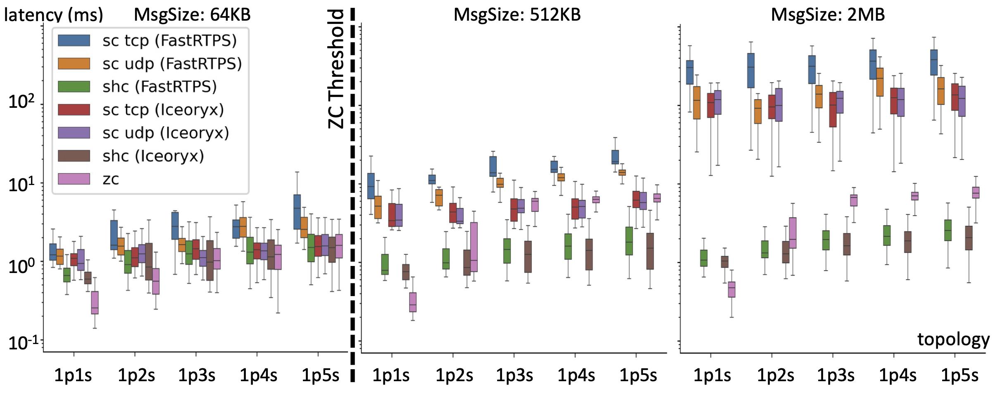

# ROS4K: ROS for Kubernetes


## Orchestration-aware optimization of ROS2 communication protocols

The robot operating system (ROS) standard has been extended with different communication mechanisms to address real-time and scalability requirements. On the other hand, containerization and orchestration platforms like Docker and Kubernetes are increasingly being adopted to strengthen platform-independent development and automatic deployment of software. In this work we quantitatively analyze the impact of topology, containerization, and edge-cloud distribution of ROS nodes on the efficiency of the ROS2 communication protocols. We then present a framework that automatically binds the most efficient ROS protocol for each node-to-node communication by considering architectural characteristics of both software and edge-cloud computing platform. 



## Contributions

- A zero-copy inter-process communication protocol called SHared Copy (SHC) and a performance analysis of ROS-compliant topic-based communication to show how communication topology, containerization, and edge-cloud distribution of ROS nodes can impact on the performance of the different communication protocols (i.e., SC, ZC, SHC). 
- A framework to bind the most efficient protocol for each node-to-node communication by considering such impacting factors.
- A library called ROS4K that extends the standard ROS2 primitives for the automatic binding of protocols to the ROS nodes at compile time. The library aims at customizing the communication protocols without modifications to the application code to preserve its portability.

## Configurations

Setup: 
```bash
# Dashing
sudo apt update && sudo apt install curl gnupg2 lsb-release
sudo curl -sSL https://raw.githubusercontent.com/ros/rosdistro/master/ros.key  -o /usr/share/keyrings/ros-archive-keyring.gpg
echo "deb [arch=$(dpkg --print-architecture) signed-by=/usr/share/keyrings/ros-archive-keyring.gpg] http://packages.ros.org/ros2/ubuntu $(lsb_release -cs) main" | sudo tee /etc/apt/sources.list.d/ros2.list > /dev/null
sudo apt update
sudo apt install ros-dashing-desktop

# Eloquent (suggested)
sudo apt update && sudo apt install curl gnupg2 lsb-release
curl -s https://raw.githubusercontent.com/ros/rosdistro/master/ros.asc | sudo apt-key add -
sudo sh -c 'echo "deb [arch=$(dpkg --print-architecture)] http://packages.ros.org/ros2/ubuntu $(lsb_release -cs) main" > /etc/apt/sources.list.d/ros2-latest.list'
sudo apt update
sudo apt install ros-eloquent-desktop

sudo apt install python3-colcon-common-extensions

# ROSDEP
sudo rosdep init
rosdep update --include-eol-distros

# ROS2 Dashing
source /opt/ros/dashing/setup.bash
# ROS2 Eloquent
source /opt/ros/eloquent/setup.bash
```

Download: 

```bash
mdkir ros_ws && cd ros_ws
mkdir src && cd src
git clone https://github.com/PARCO-LAB/ros4k.git ros4k
cd ..
```

Build: 

```bash
colcon build --packages-select ros4k
. install/setup.bash
```

Iceoryx: 
```bash
# Dependencies: 
sudo apt-get install -y libacl1*
sudo apt-get install libncurses5-dev libncursesw5-dev

# Download and compile: 
# Refer to https://github.com/ros2/rmw_iceoryx for more details
cd src
git clone https://github.com/eclipse/iceoryx.git
git clone --branch eloquent https://github.com/ros2/rmw_iceoryx.git
cd ..
source /opt/ros/eloquent/setup.bash  # alternatively source your own ROS 2 workspace
colcon build
. install/setup.bash

# Start the deamon:
./install/iceoryx_posh/bin/RouDi
# Prefix: RMW_IMPLEMENTATION=rmw_iceoryx_cpp
```

Docker:
```bash
# For x86
docker build -t images:ros2-shc -f Dockerfile.x86 . --network=host
# For NVIDIA Jetson
docker build -t images:ros2-shc -f Dockerfile.arm . --network=host
```

## Benchmarking

Machine

```bash
bash src/ros4k/script/1p1s.bash
bash src/ros4k/script/NpNs.bash
```


Single container

```bash
docker-compose -f docker-compose.single.yaml up -d
docker exec -it shc0 bash
source /ros_ws/install/setup.bash
cd /ros_ws/docker
bash src/ros4k/script/docker_single/1p1s.bash
bash src/ros4k/script/docker_single/NpNs.bash
```

Multi container
```bash
docker-compose -f docker-compose.multi.yaml up -d
bash src/ros4k/script/docker_multi/1p1s.bash
bash src/ros4k/script/docker_multi/NpNs.bash
```


## Results

Plotting results: 
```bash
cd src/ros4k
bash script/plot.bash
```





## Other related works


TZC: Efficient Inter-Process Communication for Robotics Middleware with Partial Serialization ([TZC](https://github.com/Jrdevil-Wang/tzc_transport.git))

Smart Pointers and Shared Memory Synchronisation for Efficient Inter-process Communication in ROS on an Autonomous Vehicle ([LOTROS](https://github.com/fiveai/ros_comm.git))


## Citation and Contribution guidelines

```math
@article{}
```

If you would like to contribute to ROS4K, please contact:

* Mirco De Marchi <mirco.demarchi@univr.it>
* Nicola Bombieri <nicola.bombieri@univr.it>

